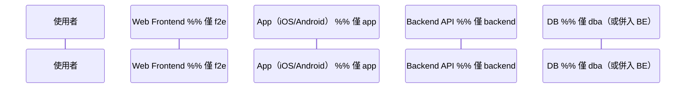
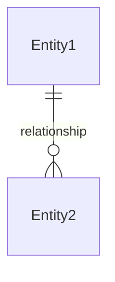

# spec-pipeline:spec-deliver — FRD → Delivery Spec 產生器

把 FRD 轉換成**所有相關 RD 可直接開工的交付規格文件**。

## 核心原則

> **Delivery Spec 是 FRD 的工程翻譯。FRD 說「做什麼」，Delivery Spec 說「每個人做哪一塊、怎麼接」。**

---

## Usage

```
spec-pipeline:spec-deliver                     # 互動模式，需要指定 FRD 位置
spec-pipeline:spec-deliver {frd-path}          # 讀取 FRD，開始產出
```

如果未指定 FRD 路徑，在 `docs/specs/` 目錄中以 `*-frd.md` pattern 搜尋。如果有多個，取檔案修改時間最新者。如果找不到，詢問使用者指定路徑。

如果使用者指定了 FRD 路徑，先確認檔案存在。如果不存在，告知使用者並詢問正確路徑。

---

## 前置：角色確認

角色來源優先順序：
1. 從 `spec-pipeline:spec-pipeline` 傳入（如果從 pipeline 進入）
2. 從 FRD 的「涉及角色」欄位讀取
3. 如果兩者皆不可得，詢問使用者本次涉及哪些角色（f2e / app / backend / dba，QA 永遠啟用）

如果 (1) 和 (2) 衝突，以 (1) 為準並提示使用者。

角色決定本文件的讀者是誰，以及要產出哪些章節。

### 讀者 × 角色對照

| 角色 | 讀者需要什麼 |
|------|------------|
| `f2e` | API 契約、路由定義、狀態管理建議、渲染策略、元件結構 |
| `app` | API 契約、推播 payload、Deep Link、離線行為、原生元件 |
| `backend` | API 契約、DB schema、排程邏輯、auth 策略、並行安全 |
| `dba` | DDL、索引策略、DB 平台對照、讀寫分離、Trigger 範例 |

---

## 產出結構（固定章節，依角色裁剪）

### A. 系統責任矩陣

按「要建什麼」分派工作項，不是按 User Story。

結構：按功能群組分小節，每個小節一張四欄表：

| 工作項 | 負責系統 | 輸入 | 輸出 |
|--------|----------|------|------|

**「負責系統」依選定角色動態調整圖例：**

| 角色 | 系統名稱 | 圖例 |
|------|---------|------|
| `f2e` | Web Frontend | 🔵 |
| `app` | App（iOS / Android） | 🟢 |
| `backend` | Backend API / Worker | 🟣 |
| `dba` | Database | （不單獨列，併入 Backend） |
| 共通 | 推播平台 / CDN / CMS 等 | 依實際系統標示 |

**分組原則：**
- 聚合層（全案地基）：核心實體建模、成員管理、入口容器、路由
- 功能群組（按 Story）：每個 Story 的工作項
- 事件追蹤（通常最後）

### A2. 互動式對話架構（Interact Pattern）

**僅在產品有對話式 UI 時才產出此章節。**

如果產品是對話式介面（chat-like），需要定義：
1. **渲染決策流程**（flowchart）：renderMode → msgType 認識與否 → fallback
2. **Action 處理流程**（sequence diagram）
3. **訊息責任矩陣**：每個 msgType 的觸發 Action、renderMode、回應來源

### B. 時序圖（Sequence Diagrams）

為每個關鍵流程產出 mermaid sequence diagram。

**participant 依選定角色動態調整：**



**必出的流程：**
- 使用者首次進入的 onboarding 流程
- 核心功能的 happy path
- 涉及外部系統的流程
- 多人協作流程（如果有）

### C. API 契約

為每支 API 產出完整契約。統一編號 C-0 ~ C-N。

**每支 API 的固定結構：**

```
### C-{N}. {API 名稱}

{METHOD} /path/{param}
Headers: Authorization: {accessToken}
Body: { ... }

// 設計註解

Response {statusCode}:
{ ... }

Error {code}: { "error": "{ERROR_CODE}" }

// 實作備註
```

**API 契約必須包含的元素：**

1. **認證**：統一寫在章節開頭
2. **userID 來源**：明確寫「從 token 解析」或「client 傳入」
3. **分頁策略**：cursor-based（keyset pagination）
4. **冪等性**：哪些 API 是冪等的
5. **錯誤碼**：
   - 400：參數錯誤
   - 403：無權限
   - 404：找不到
   - 422：業務規則阻擋（不是 403）
   - 429：Rate limit
6. **前端/App 端備註**：依選定角色，標注 `f2e` 或 `app` 端需要注意的事項
7. **網路錯誤行為**（`app` 或 `f2e`）：每支 API 標註失敗時的 UX 策略（見下方模式）

**關鍵模式（通用，ANSI SQL）：**

- **Cursor pagination**：`createdAt + ID` 組合鍵（keyset），不用 offset
- **UNION ALL**：混合查詢用 UNION ALL，不用 OR
- **Atomic operations**：用 `UPDATE ... WHERE condition` + affected_rows
- **冪等 UPSERT**：依 DB 平台選擇語法（PostgreSQL: `ON CONFLICT DO NOTHING`、MySQL: `INSERT IGNORE` / `ON DUPLICATE KEY`、MS-SQL: `MERGE`）
- **Status 動態計算**：不存 DB，API response 中動態算
- **Sentinel value**：UNIQUE INDEX 中用 sentinel 字串取代 NULL（注意 NULL 在不同 DB 的 UNIQUE 行為不同：PostgreSQL 允許多個 NULL，MS-SQL 不允許）

### D. 平台策略（依角色裁剪）

**D 章節是動態的——只產出選定角色需要的小節。**

#### D-1. 認證策略 — 所有角色必出

讀取 codebase 確認：
（如果是 Greenfield 專案，改為根據 FRD 中的技術棧決策來定義認證策略，而非掃描現有實作。）
- Token 來源
- Header 格式（有沒有 Bearer 前綴）
- Token 刷新機制
- userID 取得方式

**有 `app` 時額外確認：**
- 安全儲存方式（iOS: Keychain、Android: Keystore / EncryptedSharedPreferences）
- 登入狀態管理（session / member info 的存取方式）
- Device header 結構

**有 `f2e` 時額外確認：**
- Token 存放（cookie / localStorage / memory）
- CSRF 防護
- SSR 時的 token 處理

#### D-2. 推播 Payload — 僅 `app` 角色

讀取 codebase 確認現有推播結構。
（Greenfield 專案：根據 FRD 需求定義推播結構，標註推薦方案及理由。）

包含：
1. Payload 結構（沿用現有框架）
2. 各通知類型差異表
3. App 端路由邏輯（前景/背景/Cold launch）
4. 新增欄位的向下相容策略

#### D-2b. 即時通訊策略 — 僅 `f2e` 角色（如果有）

包含：
1. WebSocket / SSE / Polling 選擇
2. 重連策略
3. 訊息同步機制

#### D-3. 生命週期 — 所有角色必出

1. 狀態定義（動態計算 vs DB 存儲）
2. 建立流程
3. 取消流程
4. Admin / Internal API

#### D-4. 結束後行為矩陣 — 所有角色必出

**這是最容易遺漏的章節。**

| API | 行為 | 說明 |
|-----|------|------|

三種可能行為：
- **正常回傳**：唯讀查看
- **拒絕 → 422**：業務規則阻擋
- **降級回傳**：回傳但標記狀態

**有 `app` 時**：列出 App 端行為（哪些按鈕隱藏/灰化）
**有 `f2e` 時**：列出 Web 端行為（哪些元件 disabled/hidden）

#### D-5. 網路錯誤與韌性策略 — `app` 或 `f2e` 角色

**這是前端/App 交付最容易被「之後再處理」然後就忘記的章節。必須在 Delivery Spec 中定義，不能留給 RD 自行決定。**

產出一張 **API 網路行為矩陣**：

| API | 失敗類型 | Retry | 使用者感知 | 降級行為 |
|-----|---------|-------|-----------|---------|
| C-0 旅程詳情 | timeout / 5xx | 自動 1 次 | skeleton → 錯誤提示 + 重試按鈕 | 無（blocking） |
| C-2 Inbox | timeout / 5xx | 自動 2 次 | skeleton → 錯誤提示 | 顯示快取的舊訊息 |
| C-3 標記已讀 | timeout / 5xx | 背景自動 3 次 | silent（使用者無感知） | 本地先標已讀，背景重試 |
| C-5 互動 | timeout / 5xx | 不自動 | 送出按鈕 loading → 錯誤 toast + 重試 | 無 |
| ... | ... | ... | ... | ... |

**矩陣中每支 API 必須回答 4 個問題：**

1. **Retry 策略**：自動 retry 幾次？間隔？（指數退避 or 固定？）哪些 HTTP status 可 retry（5xx/timeout），哪些不可（4xx）？
2. **使用者感知**：API call 進行中 → 成功 → 失敗，使用者分別看到什麼？
3. **降級行為**：失敗後能不能用快取/本地資料撐住？還是必須 blocking？
4. **樂觀 vs 悲觀**：先更新 UI 再等 API（樂觀），還是等 API 回來才更新（悲觀）？

**通用預設（API 沒有特別標註的就用預設）：**

```
預設 Timeout:
  讀取類 API（GET）:  10 秒
  寫入類 API（POST/PUT）: 30 秒

預設 Retry:
  可 retry 條件: HTTP 408, 429, 500, 502, 503, 504, 網路不可達
  不可 retry: HTTP 400, 401, 403, 404, 422（業務錯誤不重試）
  間隔: 指數退避（1s → 2s → 4s），最多 3 次
  429 時: 讀 Retry-After header

預設 Loading 狀態:
  首次載入: skeleton screen（不用 spinner）
  重新載入: 保持舊內容 + 頂部 loading indicator
  送出操作: 按鈕 loading state（disabled + spinner）

預設錯誤 UI:
  inline error: 局部失敗（單一區塊載入失敗）
  toast: 操作失敗（送出/標記/互動）
  全頁錯誤 + 重試按鈕: 核心資料載入失敗（整個頁面無法使用）
```

**有 `app` 時額外定義：**

```
離線模式:
  偵測方式: iOS: NWPathMonitor / Android: ConnectivityManager
  離線時可用功能: {列出具體功能，例如：已快取的語音導覽播放、已載入的歷史訊息瀏覽}
  離線時不可用: {列出，例如：互動、標記已讀、邀請}
  離線→上線 恢復策略: {自動重新載入當前頁? 靜默同步佇列?}

背景請求:
  App 進背景時 in-flight request: iOS: URLSession background task / Android: WorkManager — 允許完成當前請求
  Token 過期 + 離線: 網路恢復後先 refresh token 再 retry 業務請求
```

**有 `f2e` 時額外定義：**

```
快取策略:
  SWR / React Query staleTime: {依 API 類型，例如列表 30s，詳情 5min}
  錯誤邊界粒度: {元件級 / 頁面級 / 全域}

SSR 失敗:
  API 在 SSR 階段掛掉: {回傳 fallback HTML + client-side 重試? 直接 503?}

即時連線:
  WebSocket 斷線: 指數退避重連（1s → 2s → 4s → 8s，cap 30s）
  重連成功後: 重新訂閱 + 拉取缺失的 delta
```

#### D-6. 路由策略 — `app` 或 `f2e` 角色

**有 `app` 時：**
- URL scheme（Deep Link 格式）
- Universal Link 處理
- 未登入時的 inviteToken 暫存策略

**有 `f2e` 時：**
- 前端路由規則
- Query parameter 設計
- 未登入時的 redirect 策略

#### D-7. 存取控制策略 — 所有角色（如有複雜授權需求）

僅在 FRD 標示有 RBAC / ABAC / 多租戶需求時產出。

包含：
1. 授權模型（RBAC / ABAC / 自訂）
2. 權限粒度（頁面級 / 功能級 / 欄位級）
3. 多租戶資料隔離策略（如適用）
4. 權限檢查位置（middleware / service layer / DB row-level security）

**有 `f2e` 時**：哪些路由/元件需要權限 guard
**有 `app` 時**：哪些功能在無權限時隱藏 vs 灰化 vs 提示
**有 `backend` 時**：API 層的權限檢查邏輯
**有 `dba` 時**：row-level security 或 tenant_id 欄位設計

#### D-8. 國際化策略（i18n）— 所有角色（如有多語系需求）

僅在 FRD 標示有多語系需求時產出。

包含：
1. 支援語系清單
2. 翻譯來源與管理機制
3. 語系偏好存取（profile / browser / device）
4. 在地化項目（幣別、日期、數字格式）

**有 `f2e` 時**：i18n 框架整合（react-intl / next-intl / vue-i18n 等）、locale 偵測、RTL 佈局支援
**有 `app` 時**：裝置語系處理、string bundle 管理、App Store 多語系 metadata
**有 `backend` 時**：locale-aware API response（Accept-Language header）、多語內容儲存策略
**有 `dba` 時**：多語內容 DB 設計（分表 vs JSON vs 欄位後綴）

#### D-9. 可觀測性策略（Observability）— 主要 `backend`，但所有角色適用

包含：
1. 關鍵指標定義（延遲、錯誤率、吞吐量）
2. Structured logging 策略（correlation ID、request tracing）
3. 告警規則（觸發條件、通知管道）
4. 前端/App 端 metrics（如適用：crash report、performance timing）

### E. 資料庫架構設計 — 僅 `dba` 角色（或 `backend` 時簡化版）

**有 `dba` 角色時：完整版**
- E-1 ~ E-N：各表 DDL（通用 SQL）
- E-{N+1}：DB 平台對照表（如果目標 DB 不是通用 SQL）
- E-{N+2}：讀寫分離建議
- ER 關係圖

**只有 `backend` 沒有 `dba` 時：簡化版**
- 表結構描述（不出 DDL）
- 關鍵索引建議
- ER 關係圖

#### DDL 撰寫規範（ANSI SQL 為基底）

- 系統識別碼 / 列舉：`VARCHAR`
- 人類可讀文字：`VARCHAR`（如需 Unicode 且目標 DB 為 MS-SQL，對照表中標註 NVARCHAR）
- 時間：`TIMESTAMP`（MySQL: `DATETIME`、MS-SQL: `DATETIME2`）
- 布林：`BOOLEAN`（MS-SQL: `BIT`）
- JSON：`JSON`（MS-SQL: `NVARCHAR(MAX)` + `ISJSON CHECK`）
- 自增主鍵：`SERIAL`（PostgreSQL）/ `AUTO_INCREMENT`（MySQL）/ `IDENTITY`（MS-SQL）

#### DB 平台對照表（有 `dba` 時必出）

先在 Step 0 確認目標 DB 平台，再產出對照表。

| 項目 | 文件中寫法（ANSI SQL） | 目標 DB 對應 | 備註 |
|------|----------------------|-------------|------|

**必須涵蓋：**
- 型別轉換
- 自動更新時間（Trigger 或框架機制）
- 時間函式
- 分頁語法（keyset pagination 的 DB 適配）
- UNIQUE INDEX + NULL 行為（各 DB 不同）
- affected_rows（各 DB 取得方式不同）
- 列舉 CHECK
- 樂觀並行控制（row version / `xmin` / timestamp 比對）

**必須附上的範例程式碼（依目標 DB 調整語法）：**
- updatedAt 自動更新（Trigger 或 ORM hook）
- Atomic claim（queue 處理：PostgreSQL 用 `FOR UPDATE SKIP LOCKED`、MS-SQL 用 `ROWLOCK + READPAST`、MySQL 用 `FOR UPDATE`）
- Atomic verify（token 驗證）

#### 讀寫分離建議（如有讀寫分離架構）

| API | 操作 | 方向 | 建議 |
|-----|------|------|------|

判斷原則：
- 純 SELECT 且可容忍延遲 → READ（Replica）
- 純 SELECT 但是 WRITE 的消費端 → PRIMARY（read-your-own-writes）
- INSERT / UPDATE → WRITE（Primary）

#### ER 關係摘要



---

## 輸出格式

**預設 Markdown**（HackMD 相容）：
- Mermaid 圖用 ` ```mermaid ` fenced block（HackMD 原生支援）
- API 契約用 fenced code block
- 表格用 Markdown table（HackMD 支援表格內 `<br>`）
- SQL DDL 用 ` ```sql ` fenced block
- 可用 Artifact 發佈預覽

---

## 品質檢查

| 檢查項 | 標準 |
|--------|------|
| 每支 API 都有錯誤碼？ | 至少 403 + 404 |
| 結束後行為矩陣完整？ | 每支 API 都有定義 |
| 章節只涵蓋選定角色？ | 沒有 `app` 就不該出現推播 payload |
| DB FK 兩端型別一致？ | VARCHAR 不能指向 NVARCHAR |
| 時區策略一致？ | 全文件同一套 |

---

## 產出物

- 檔案：`docs/specs/{topic}-system-flows.md`
- Artifact：可選，使用者需要時發佈預覽
- Commit message：`docs: add {topic} delivery spec`

完成後提示：
> 「Delivery Spec 已產出。涵蓋角色：{roles}。確認後可以 `spec-pipeline:spec-review` 進入 Review 階段。」
